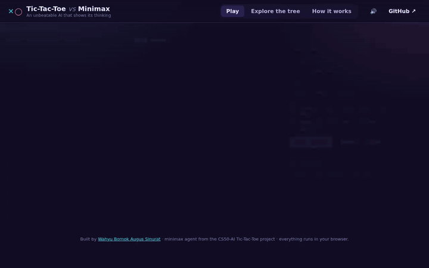
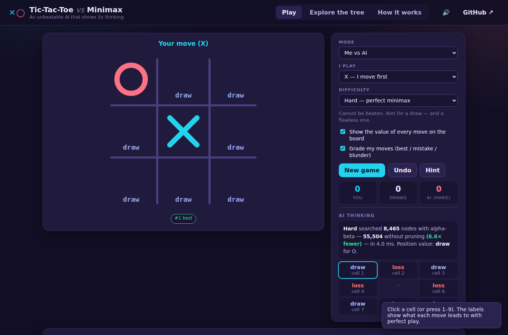
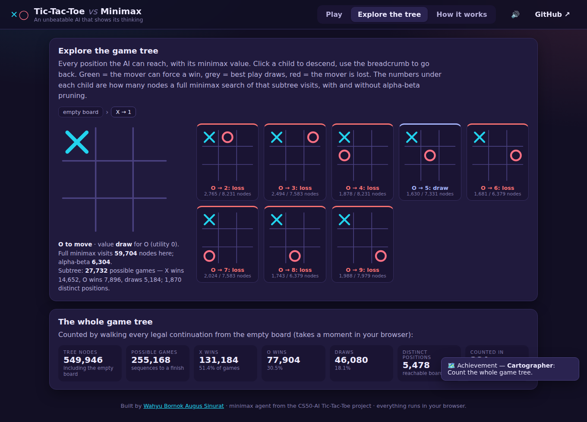

<div align="center">

# ✕◯ Tic-Tac-Toe vs Minimax

**Play it now → [officiel-tinkerthink.github.io/AI-against-Tic-Tac-Toe](https://officiel-tinkerthink.github.io/AI-against-Tic-Tac-Toe/)**

An unbeatable minimax AI that **shows its thinking** — the value of every move, how many positions it searched with and
without alpha-beta pruning, a grade for each of your moves, and an explorer for the entire game tree.

[](https://officiel-tinkerthink.github.io/AI-against-Tic-Tac-Toe/)




</div>

---

## What's inside

| | |
|---|---|
| **Three opponents** | **Easy** plays randomly. **Medium** runs minimax but only two moves deep — it takes wins and blocks threats, but walks into forks. **Hard** searches to the end and cannot be beaten. |
| **Move values on the board** | Every empty cell is labelled *win / draw / loss* — what that move leads to against perfect play. Turn it off when you want a real fight. |
| **Move grading** | Each of your moves is rated **best**, **mistake** (threw away a win) or **blunder** (turned a draw into a loss), with Undo to try again and a Hint that shows the best move. |
| **AI thinking panel** | After every AI move: nodes searched with alpha-beta vs. without (549,945 → 34,202 on the opening move), time taken, the value of the position, and the value of each candidate. |
| **Game-tree explorer** | Click through every reachable position with its minimax value and per-subtree node counts; count the whole tree (255,168 games, 5,478 positions) in your browser. |
| **Modes** | Me vs AI (as X or O), two-player hot-seat, AI vs AI to watch. Scores per difficulty, move accuracy, achievements, sound, keyboard (1–9, N, Z, H). |

<div align="center">

<br><br>

</div>

## Run it locally

Static web app — no build step, no dependencies.

```bash
git clone https://github.com/Officiel-TinkerThink/AI-against-Tic-Tac-Toe.git
cd AI-against-Tic-Tac-Toe
python3 -m http.server 8000 --directory docs     # or: npm start
```

### Tests

```bash
node --test tests/*.test.js          # rules, textbook node counts, fork-blindness of depth-2, perfect play, grading, tree stats
python3 -m unittest discover tests   # original Python minimax
```

## Project layout

```
docs/               ← web app (GitHub Pages)
  js/ttt.js         port of tictactoe.py + alpha-beta, depth limit, per-move evals, tree statistics
  js/app.js         board UI, grading, thinking panel, tree explorer, stats
tictactoe.py        ← the original CS50-AI minimax
runner.py           ← the original pygame UI (python3 runner.py)
tests/              ← node:test + unittest suites
scripts/            ← Playwright demo recorder
assets/             ← demo GIF/MP4, screenshots, font for pygame
```

## How it works

**Minimax.** Every finished board gets a utility: +1 X wins, −1 O wins, 0 draw. On X's turn a position is worth the
*max* over its moves, on O's turn the *min*. From the empty board the value is 0 — perfect play always draws.

**Alpha-beta pruning** (the README's "further idea", now implemented): keep α (best X can already force) and β (best O can);
stop exploring a branch once α ≥ β because it can't change the decision. Same move, a fraction of the work:

| Position | Minimax nodes | Alpha-beta nodes |
|---|---|---|
| Empty board | 549,945 | 34,202 |
| After X in the centre | 55,504 | 8,465 |
| After X in a corner | 59,704 | 6,304 |

**Depth-adjusted values.** Wins found sooner score slightly higher than wins found later, so the AI finishes fast and
delays losses — giving a human the most chances to slip.

## The original

`tictactoe.py` (CS50-AI) with a pygame runner: `pip install -r requirements.txt && python3 runner.py`.
Demo video of the pygame version: [Google Drive](https://drive.google.com/file/d/14lhgdW1Nfqcc3N3MKdeFUBcXElHv09i9/view?usp=sharing).

## Author

**Wahyu Bornok Augus Sinurat** — [@Officiel-TinkerThink](https://github.com/Officiel-TinkerThink) · MIT License
